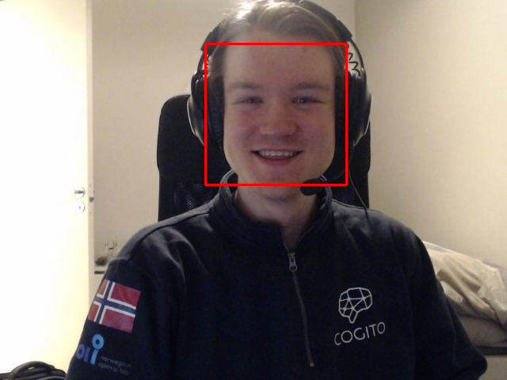

# Intruder Alert

<div align="center">
    
</div>

Have you ever wanted to know who's been snooping around your computer while you're away?
Several times, I've left my laptop unattended, only to return and find someone have been poking around (changing wallpapers, open inappropriate tabs, add button shortcuts, even fake blue screens of death) and you do not fancy just locking your computer. Then you need Intruder Alert!

**Intruder Alert** is a face detection system that utilizes OpenCV's classifiers to identify and record faces in real-time video. This system captures images of detected faces, logging the time of detection, which can be used for security monitoring and intruder detection purposes.

## Features
- Real-time face detection from webcam feed.
- Timestamped logging of detected faces.
- Headless mode for running on servers without a display (or on the laptop during lunch meetings or so).
- Saving detections as images for further analysis or evidence.
- Depth estimation using Depth Estimation model.

<div align="center">
    
    
</div>

## Prerequisites
Ensure Python 3.11 or newer is installed on your machine. [Download Python](https://www.python.org/downloads/)

Then, install the required packages by running the following command in the project directory:
```bash
pip install -r requirements.txt
```

## Usage
To start the face detection, navigate to the project directory and run:

```bash
python main.py
```

The system will activate the webcam and begin scanning for faces. Detected faces will be displayed in real-time, and images will be saved in the detections/ directory under the project folder.

Press `q` while focused on the video window to quit the application.


### Headless Mode (aka Ninja Mode)
To run the system in headless mode, use the `--headless` flag:
```bash
python main.py --headless
```